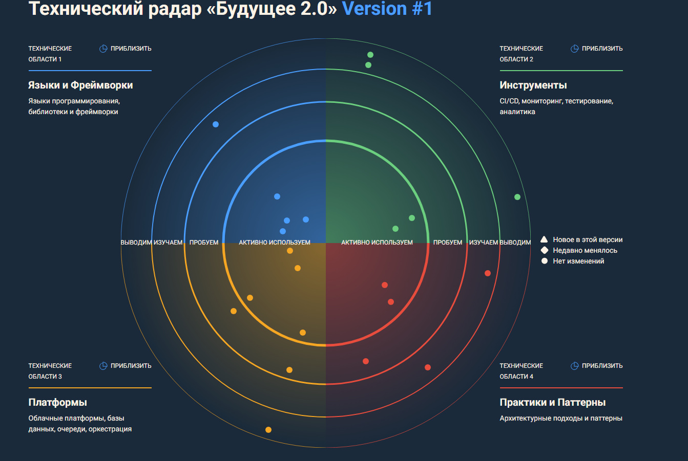
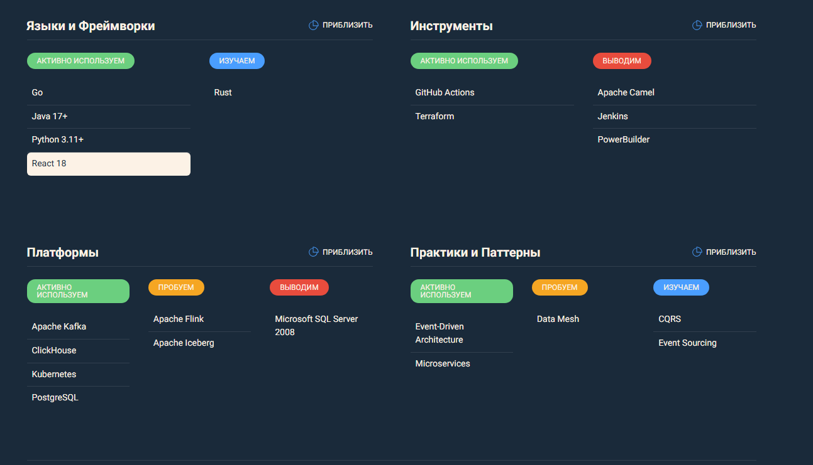

# Технический радар «Будущее 2.0»

## Легенда

| Кольцо | Значение                                                        |
|--------|-----------------------------------------------------------------|
| Adopt  | Активно используем в production, рекомендуем для новых проектов |
| Trial  | Пробуем в пилотных проектах, выявляем ограничения               |
| Assess | Изучаем, оцениваем потенциал для бизнеса                        |
| Hold   | Выводим из использования, не рекомендуем для новых проектов     |

## Квадранты

| Квадрант               | Описание                                              |
|------------------------|-------------------------------------------------------|
| Языки и фреймворки     | Языки программирования, библиотеки, фреймворки        |
| Инструменты            | CI/CD, мониторинг, тестирование, аналитика            |
| Платформы              | Облачные платформы, базы данных, очереди, оркестрация |
| Архитектурные паттерны | Подходы к построению систем                           |

## 1. Языки и фреймворки

| Технология    | Статус | Обоснование                                                     |
|---------------|--------|-----------------------------------------------------------------|
| Go            | Adopt  | Высокая производительность, простота, хорош для финтех-сервисов |
| Java 17+      | Adopt  | Стабильность, экосистема, core banking системы                  |
| Python 3.11+  | Adopt  | ИИ-сервисы, анализ данных, FastAPI                              |
| React 18      | Adopt  | Портал самообслуживания, UI компоненты                          |
| Spring Boot 3 | Adopt  | Микросервисы на Java                                            |
| FastAPI       | Adopt  | ИИ-сервисы, высокая производительность                          |
| Kotlin        | Trial  | Альтернатива Java для новых сервисов                            |
| Rust          | Assess | Для высоконагруженных компонентов                               |
| Vue.js        | Hold   | Решение не принято, используем React                            |
| PHP           | Hold   | Устаревший стек, не для новых проектов                          |

## 2. Инструменты

| Технология           | Статус | Обоснование                                                                                                                                      |
|----------------------|--------|--------------------------------------------------------------------------------------------------------------------------------------------------|
| Terraform            | Adopt  | IaC, управление облачной инфраструктурой                                                                                                         |
| GitHub Actions       | Adopt  | CI/CD, автоматизация деплоя                                                                                                                      |
| Prometheus + Grafana | Adopt  | Мониторинг и визуализация метрик                                                                                                                 |
| ELK Stack            | Adopt  | Централизованный сбор и анализ логов                                                                                                             |
| Jaeger / Tempo       | Trial  | Distributed tracing для микросервисов                                                                                                            |
| SonarQube            | Adopt  | Статический анализ кода                                                                                                                          |
| dbt                  | Trial  | Трансформация данных в аналитическом домене                                                                                                      |
| Great Expectations   | Trial  | Data quality и валидация                                                                                                                         |
| ArgoCD               | Assess | GitOps для Kubernetes                                                                                                                            |
| Jenkins              | Hold   | Заменяем на GitHub Actions                                                                                                                       |
| PowerBuilder         | Hold   | Полный отказ, легаси                                                                                                                             |
| Apache Camel         | Hold   | Не сам фреймворк, а ESB/SOA подход. Целевая архитектура использует Kafka + потоковую обработку (Kafka Streams/Flink) вместо централизованной ESB |

## 3. Платформы

| Технология                       | Статус | Обоснование                                       |
|----------------------------------|--------|---------------------------------------------------|
| Yandex Cloud                     | Adopt  | Основной облачный провайдер                       |
| Kubernetes (Yandex Managed)      | Adopt  | Оркестрация микросервисов                         |
| Yandex Object Storage (S3)       | Adopt  | Хранение state-файлов, data lake                  |
| Apache Kafka                     | Adopt  | Событийная шина, stream processing                |
| ClickHouse                       | Adopt  | Аналитическая витрина, высокая производительность |
| PostgreSQL                       | Adopt  | Основная БД для микросервисов                     |
| Redis                            | Adopt  | Кэширование, сессии, очереди                      |
| Yandex Managed Service for Kafka | Adopt  | Управляемый Kafka                                 |
| Debezium                         | Trial  | CDC для миграции данных                           |
| Apache Flink                     | Trial  | Stream processing для сложных сценариев           |
| Apache Iceberg                   | Assess | Data lake табличный формат                        |
| Microsoft SQL Server 2008        | Hold   | Легаси, выводим из эксплуатации                   |

## 4. Архитектурные паттерны

| Паттерн                      | Статус | Обоснование                                                                                 |
|------------------------------|--------|---------------------------------------------------------------------------------------------|
| Event-Driven Architecture    | Adopt  | Слабосвязанные домены через события                                                         |
| Microservices                | Adopt  | Доменная декомпозиция, независимое масштабирование                                          |
| API Gateway                  | Adopt  | Единая точка входа, маршрутизация                                                           |
| C4 Model                     | Adopt  | Документирование архитектуры                                                                |
| Data Mesh                    | Trial  | Децентрализованное управление данными                                                       |
| Self-service BI              | Adopt  | Портал самообслуживания для аналитики                                                       |
| Anti-Corruption Layer        | Adopt  | Интеграция с легаси-системами                                                               |
| Saga Pattern                 | Trial  | Управление распределёнными транзакциями                                                     |
| CQRS                         | Assess | Разделение чтения и записи                                                                  |
| Event Sourcing               | Assess | Хранение состояния как потока событий                                                       |
| Strangler Fig Pattern        | Adopt  | Поэтапная миграция с легаси                                                                 |
| Dual-write                   | Trial  | Безопасная миграция данных                                                                  |
| Monolith (new)               | Hold   | Не используем для новых проектов                                                            |
| ESB (Enterprise Service Bus) | Hold   | Централизованная шина заменяется на децентрализованную событийную архитектуру (EDA) с Kafka |

## Визуализация радара

За основу взят технический радар от AOE:

```shell
#перейдем в каталог с SPA-приложением радаром 
cd Task5Advanced/techradar
```

```shell
#Устанавливаем. Версия NodeJS
npm install
```

```shell
#сборка и запуск
npm run build
npm run serve
```

открываем по  http://localhost:3000/



